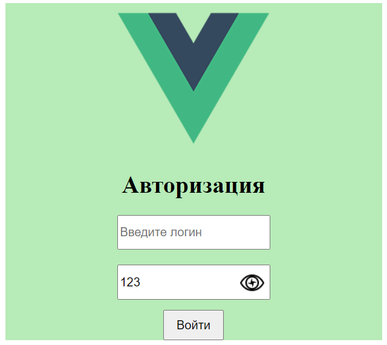
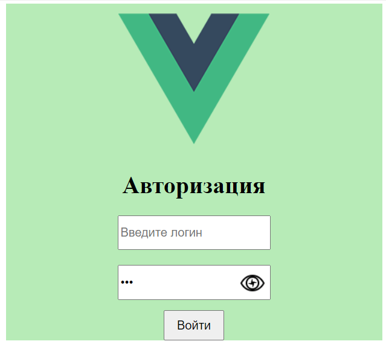

<p align=center>МИНИСТЕРСТВО НАУКИ И ВЫСШЕГО ОБРАЗОВАНИЯ
<p align=center>РОССИЙСКОЙ ФЕДЕРАЦИИ
<p align=center>ФЕДЕРАЛЬНОЕ ГОСУДАРСТВЕННОЕ БЮДЖЕТНОЕ ОБРАЗОВАТЕЛЬНОЕ
<p align=center>УЧРЕЖДЕНИЕ ВЫСШЕГО ОБРАЗОВАНИЯ
<p align=center>«ВЯТСКИЙ ГОСУДАРСТВЕННЫЙ УНИВЕРСИТЕТ»
<p align=center>Институт математики и информационных систем
<p align=center>Факультет автоматики и вычислительной техники
<p align=center>Кафедра систем автоматизации управления
<p><br>


<p align=center>ESlint,Webpack,Axios.
<p><br><br>
<p align=right>Разработал студент гр. ИТб-2303-01-00 ________________ /Коровинкий Н.С./
<p align=right>Проверил ст. преподаватель _________________ /Земцов М.А./
<p align=right>Работа защищена с оценкой	«___________» «___» __________ 2022 г.
<p><br><br><br>
<p align=center>Киров 2022 
  
  ---
  
<p> Цель лабораторной работы: Настроить пакеты, вывести страницу сайта.
<p> Задачи лабораторной работы:  
<p>1.Сделать окно окно авторизации
<p>2.Оптимизировать под мобильный экран
<p>Ход выполнения:
<p>Сделать окно окно авторизации
<p>

<p>
<p>Оптимизировать под мобильный экран

  
  ---

  <p>Оптимизировать под мобильный экрани согласно варианту сделать отображение\скрытие пароля
  <p>
  


  Код оснавного App
  
  ```
  <template>
  <KorovinskiiComponent></KorovinskiiComponent>
   <Vyatsu :results="results"></Vyatsu>
   <Regestration></Regestration>
</template>

<script>
import Regestration from 'regestration';
import axios from 'axios';
import KorovinskiiComponent from 'korovinskii-component';
import Vyatsu from 'vytsu';

const url = 'http://localhost:8080/admission/';

export default {
  components: {
    KorovinskiiComponent,
    Vyatsu,
    Regestration,
  },
  data() {
    return { KorovinskiiComponent, results: [] };
  },
  mounted() {
    axios
      .get(url)
      .then((response) => {
        console.log(response);
        this.results = response.data;
      })
      .catch((error) => console.log(error));
  },
};
</script>

<style>
</style>

  ```

  Код авторизации 
  ```
<template>
  <div class="main">
    <div class="logo">
        
    </div>
    <div class="info">
      <h1>Авторизация</h1>
      <div>
        <input type="text"
          class="login"
          placeholder="Введите логин "
          :name="login"
        />
      </div>
      <div>
      <div class="password_label">
        <div class="password_form">
          <input
            type="password"
            class="password_form"
            id="password-input"
            placeholder="Введите пароль"
            :name="password"
          />
          <div class="password_btn">
            
          </div>
        </div>
        </div>
        <div>
          <button class="btn">Войти</button>
        </div>
      </div>
    </div>
  </div>
</template>

<script>
const ShowOrHide = () => {
  const input = document.getElementById('password-input');
  const image = document.getElementById('password-control');

  if (input != null && image != null) {
    if (input.getAttribute('type') === 'password') {
      input.setAttribute('type', 'text');
      image.classList.add('view');
    } else {
      input.setAttribute('type', 'password');
      image.classList.remove('view');
    }
    return false;
  }
  return false;
};

export default {
  components: {},
  methods: {
    showOrHide: ShowOrHide,
  },
};
</script>
<style>
.main {
  margin: 0 auto;
  width: 500px;
  display: flex;
  flex-direction: row;
  background: rgb(183, 235, 183);
}

.logo img{
  margin-top: 30px;
  height: 200px;
  width: 200px;
}

.password_form {
  margin-top: 5%;
  height: 40px;
  font-size: 16px;
}

.btn {
  margin-top: 30px;
  margin-left: 60px;
  width: 80px;
  height: 40px;
  font-size: 16px;
  cursor: pointer;
}
.login {
  height: 40px;
  font-size: 16px;
}
.password_label {
  position: relative;
}
.password_btn {
  position: absolute;
  right: 8px;
  top: 18px;
  height: 32px;
  width: 32px;
}
@media(max-width: 740px){
  .main {
    flex-direction: column;
    text-align: center;
    align-items: center;
  }
  .login {
  height: 40px;
  font-size: 26px;
  width: 300px;
}
  .password_form {
  margin-top: 5%;
  height: 40px;
  font-size: 26px;
  width: 300px;
}
  .logo img {
    margin-top: 10px;
    height: 100px;
    width: 100px;
  }
  .btn{
    margin-left: 0;
  }
  .password_btn{
    margin-top: 3px;
  }
}
</style>
  ```
