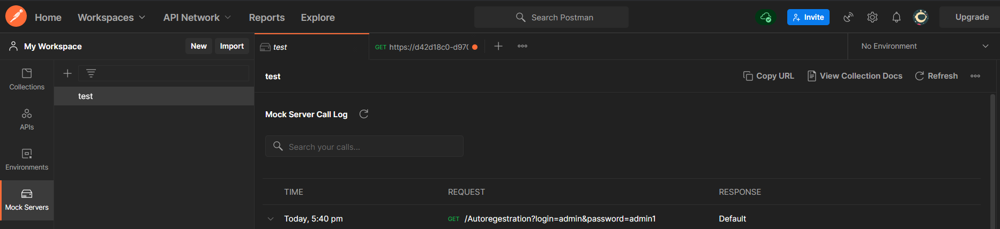
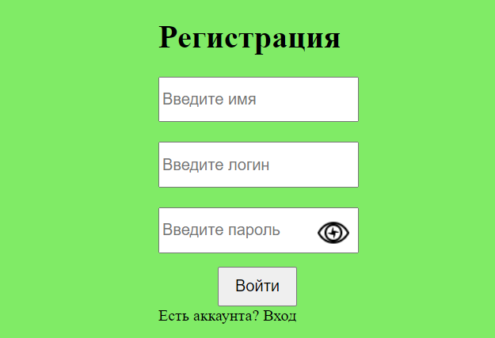
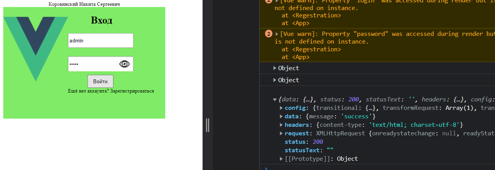
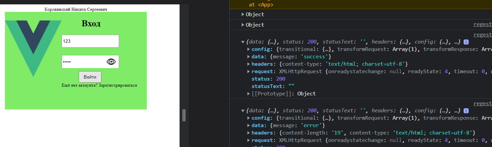
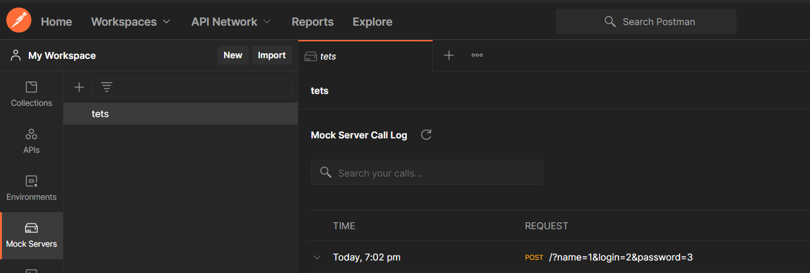

<p align=center>МИНИСТЕРСТВО НАУКИ И ВЫСШЕГО ОБРАЗОВАНИЯ
<p align=center>РОССИЙСКОЙ ФЕДЕРАЦИИ
<p align=center>ФЕДЕРАЛЬНОЕ ГОСУДАРСТВЕННОЕ БЮДЖЕТНОЕ ОБРАЗОВАТЕЛЬНОЕ
<p align=center>УЧРЕЖДЕНИЕ ВЫСШЕГО ОБРАЗОВАНИЯ
<p align=center>«ВЯТСКИЙ ГОСУДАРСТВЕННЫЙ УНИВЕРСИТЕТ»
<p align=center>Институт математики и информационных систем
<p align=center>Факультет автоматики и вычислительной техники
<p align=center>Кафедра систем автоматизации управления
<p><br>


<p align=center>Postman.
<p><br><br>
<p align=right>Разработал студент гр. ИТб-2303-01-00 ________________ /Коровинкий Н.С./
<p align=right>Проверил ст. преподаватель _________________ /Земцов М.А./
<p align=right>Работа защищена с оценкой	«___________» «___» __________ 2022 г.
<p><br><br><br>
<p align=center>Киров 2022  

  ---
  
<p> Цель лабораторной работы: Познакомиться с postman. 
<p> Задачи лабораторной работы:  
<p>1.Сделать регистрацию и вход.
<p>2.Настроить Postman.
<p> Ход выполнения работы 
<p> Настройка mock server

  
  ---

<p>Задали парметры пароля и логина.

<p>
<p>Окно авторизации

<p>
  
  ---

<p> При отправки входа сервер отправляет сообщения 

<p align=center> Успешно
<p>

<p align=center> Ошибка


<p align=center>Отправка
  
  ---

  <p>Код входа

```
<template>
  <div class="main">
    <div class="logo">
      
    </div>
    <div class="info">
      <h1>Вход</h1>
      <div>
        <input v-model="login"
          type="text"
          class="login"
          placeholder="Введите логин "
          id="login"
          :name="login"
        />
      </div>
      <div>
        <div class="password_label">
          <div class="password_form">
            <input v-model="password"
              type="password"
              class="password_form"
              id="password-input"
              placeholder="Введите пароль"
              :name="password"
            />
            <div class="password_btn">
              
            </div>
          </div>
        </div>
        <div>
          <button class="btn" v-on:click="send">Войти</button>
          <div class="linker">
            Ещё нет аккаунта?
            <router-link class="linker_style" to="../avtoreg"
              >Зарегистрироваться</router-link
            >
          </div>
        </div>
      </div>
    </div>
  </div>
</template>

<script>
import axios from 'axios';
const ShowOrHide = () => {
  const input = document.getElementById("password-input");
  const image = document.getElementById("password-control");

  if (input != null && image != null) {
    if (input.getAttribute("type") === "password") {
      input.setAttribute("type", "text");
      image.classList.add("view");
    } else {
      input.setAttribute("type", "password");
      image.classList.remove("view");
    }
    return false;
  }
  return false;
};

export default {
  components: {},
  methods: {
    showOrHide: ShowOrHide,
    send() {
      const url = "https://d42d18c0-d970-40e8-935c-e24b319e8972.mock.pstmn.io";
      
      axios
        .get(url + "/Autoregestration", {
          params: {
            "login": this.login,
            "password": this.password,
          },
        })
        .then((response) => {
          console.log(response);
        })
        .catch((error) => {
          console.error(error);
        });
    },
  },
};
</script>
<style>
.main {
  margin: 0 auto;
  width: 500px;
  height: 345px;
  display: flex;
  flex-direction: row;
  background: rgb(128, 235, 102);
}
.info h1 {
  margin-left: 70px;
}

.logo img {
  margin-top: 30px;
  height: 200px;
  width: 200px;
}

.password_form {
  margin-top: 5%;
  height: 40px;
  font-size: 16px;
}

.btn {
  margin-top: 30px;
  margin-left: 60px;
  width: 80px;
  height: 40px;
  font-size: 16px;
  cursor: pointer;
}
.login {
  height: 40px;
  font-size: 16px;
}
.password_label {
  position: relative;
}
.password_btn {
  position: absolute;
  right: 75px;
  top: 20px;
  height: 32px;
  width: 32px;
}
.regist {
  width: 300px;
  margin-top: 10px;
}
@media (max-width: 740px) {
  .main {
    flex-direction: column;
    text-align: center;
    align-items: center;
    height: 405px;
    width: 500px;
    background: rgb(128, 235, 102);
  }
  .password_btn {
    right: 20px;
  }
  .login {
    height: 40px;
    font-size: 26px;
    width: 300px;
  }
  .password_form {
    margin-top: 5%;
    height: 40px;
    font-size: 26px;
    width: 300px;
  }
  .logo img {
    margin-top: 10px;
    height: 100px;
    width: 100px;
  }
  .btn {
    margin-left: 0;
  }
  .password_btn {
    margin-top: 3px;
  }
}
</style>
```

<p>Код регистрации

```
<template>
  <div>Форма регистрации</div>
      <div class="mb-4">
        <div>Ваше имя:</div>
        <input v-model="pname"
          required
          name="name"
          type="text"
          class="form-control border border-success"
          id="formGroupExampleInput"
          placeholder="Введите имя"
        />
      </div>
      <div class="mb-4">
        <div>"
          >Придумайте логин:</div
        >
         <input v-model="plogin"
          type="text"
          class="login"
          placeholder="Введите логин "
          id="login"
          :name="login"
        />
      </div>
      <div class="mb-4">
        <div
          >Придумайте пароль:</div
        >
          <div class="password_form">
            <input v-model="ppassword"
              type="password"
              class="password_form"
              id="password-input"
              placeholder="Введите пароль"
              :name="password"
            />
      </div>
      <button type="submit" class="btn btn-success" v-on:click="enter">
        Зарегистрироваться
      </button>
    <div class="py-4 text-dark">
      Есть аккаунт?
  </div>
  </div>
  </div>
</template>

<script>
import axios from "axios";

export default {
  data() {
    return {
      post: {
        name: "",
        login: "",
        password: "",
      },
    };
  },
  methods: {
    enter() {
      const url = "https://6ef10e28-7a0d-4874-a7cd-0ee8a9c830b8.mock.pstmn.io";

      axios
        .post(
          url +
            "/?name=" +
            this.pname +
            "&login=" +
            this.plogin +
            `&password=` +
            this.ppassword
        )
        .then((response) => {
          console.log(response);
        })
        .catch((error) => {
          console.error(error);
        });
    },
  },
};
</script>


<style scoped>
.ret {
  background-color: red;
  height: 100px;
  width: 100px;
}

.blu {
  background-color: blue;
  height: 100px;
  width: 100px;
}
</style>

```