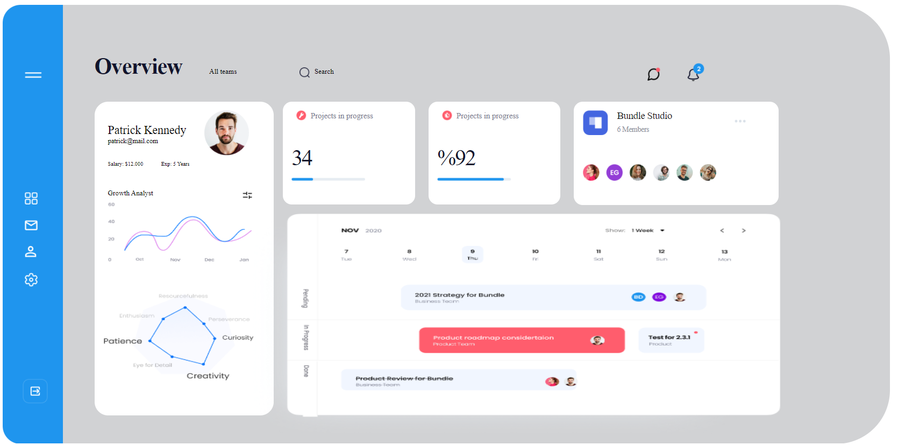

<p align=center>МИНИСТЕРСТВО НАУКИ И ВЫСШЕГО ОБРАЗОВАНИЯ
<p align=center>РОССИЙСКОЙ ФЕДЕРАЦИИ
<p align=center>ФЕДЕРАЛЬНОЕ ГОСУДАРСТВЕННОЕ БЮДЖЕТНОЕ ОБРАЗОВАТЕЛЬНОЕ
<p align=center>УЧРЕЖДЕНИЕ ВЫСШЕГО ОБРАЗОВАНИЯ
<p align=center>«ВЯТСКИЙ ГОСУДАРСТВЕННЫЙ УНИВЕРСИТЕТ»
<p align=center>Институт математики и информационных систем
<p align=center>Факультет автоматики и вычислительной техники
<p align=center>Кафедра систем автоматизации управления
<p><br>


<p align=center>Dashboard
<p><br><br>
<p align=right>Разработал студент гр. ИТб-2303-01-00 ________________ /Коровинкий Н.С./
<p align=right>Проверил ст. преподаватель _________________ /Земцов М.А./
<p align=right>Работа защищена с оценкой	«___________» «___» __________ 2022 г.
<p><br><br><br>
<p align=center>Киров 2022  

  ---
  
<p> Цель лабораторной работы: Познакомиться с postman. 
<p> Задачи лабораторной работы:  
<p>1.Сверстать dashboard
<p> Ход выполнения работы 
<p> Взять макет из figma 
<p>

<p align=center> макет из фигмы
  
  ---



<p align=center> Реализация
  
  ---


Код пакета
```
<template>
  <div class="dasBody">
    <div class="leftMenu">
      <div class="dasmin cursor">
        
      </div>
      <div class="dasmen">
        <div class="focf cursor">
          
        </div>
        <div class="email cursor" style="margin-top: 30px">
          
        </div>
        <div class="lk cursor" style="margin-top: 30px">
          
        </div>
        <div class="settings cursor" style="margin-top: 30px">
          
        </div>
      </div>
      <div class="quit">
        
      </div>
    </div>
    <div class="dasHead">
      <div class="dasheader">
        <div class="Namelogo">Overview</div>
        <div class="allteam">All teams</div>
        <div class="Search">
          <div class="searchPNG"></div>
          <div class="searchtext" style="margin-left: 10px">Search</div>
        </div>
        <div class="message">
          
        </div>
        <div class="notify"></div>
      </div>
      <div class="iop">
        <div class="dashbody">
          <div class="Profile">
            <div class="patriktext">
              <div class="patriktext1">
                Patrick Kennedy
                <div class="patricEmail">patrick@mail.com</div>
              </div>
              <div class="patriclop"></div>
            </div>
            <div class="salary">
              <div class="salaryPatrik">Salary: $12.000</div>
              <div class="YearsPatric">Exp: 5 Years</div>
            </div>
            <div></div>
            <div class="sttic">
              <div class="textstatic">Growth Analyst</div>
              <div class="staticpict">
                
              </div>
            </div>
            <div class="liners">
              
            </div>
            <div class="axim">
              
            </div>
          </div>
        </div>
        <div class="obody">
          <div class="ProjectsGroup">
            <div class="ProjectsinProgress">
              <div style="display: flex">
                <div>
                  
                </div>
                <div class="ProjectsinProgresstext">Projects in progress</div>
              </div>
              <div class="text34">34</div>
              <div>
                
              </div>
            </div>
            <div class="CompletionRate">
              <div style="display: flex">
                <div>
                  
                </div>
                <div class="ProjectsinProgresstext">Projects in progress</div>
              </div>
              <div class="text34">%92</div>
              <div>
                
              </div>
            </div>
            <div class="BundleStudio">
                <div style="display: flex">
                    <div>
                        
                    </div>
                    <div class="Bundle">Bundle Studio
                      <div class="members">6 Members</div>
                    </div>
                    <div></div>

                </div>
                    <div></div>
            </div>
          </div>
          <div>
            
          </div>
        </div>
      </div>
    </div>
  </div>
</template>
<script>
export default {};
</script>
<style>
.dasBody {
  margin-top: 20px;
  height: 980px;
  width: 1980px;
  display: flex;
  background: #d1d2d4;
  border-radius: 120px;
}
.leftMenu {
  width: 135.1px;
  height: 100%;
  border-radius: 40px 0 0 40px;
  background: #1f95ee;
}
.cursor {
  cursor: pointer;
  margin-left: 50px;
}
.dasHead {
  width: 70%;
  height: 90px;

  margin-top: 70px;
  margin-left: 70px;
}
.dasmen {
  margin-top: 250px;
}
.dasmin img {
  margin-top: 150px;
}
.quit {
  margin-top: 200px;
  margin-left: 45px;
}
.dasheader {
  display: flex;
  margin-top: 30px;
}
.Namelogo {
  font-family: Poppins;
  font-style: normal;
  font-weight: 600;
  font-size: 49.9543px;
  line-height: 75px;

  letter-spacing: -1.13533px;

  color: #11142d;
}
.allteam {
  margin-top: 40px;
  margin-left: 60px;
}
.Search {
  cursor: pointer;
  display: flex;
  margin-top: 40px;
  margin-left: 140px;
}
.message {
  margin-top: 40px;
  margin-left: 700px;
}
.notify {
  margin-top: 30px;
  margin-left: 60px;
}
.dashbody {
  display: flex;
}
.Profile {
  background: #fff;
  border-radius: 30px;
  height: 700px;
  width: 400px;
  margin-top: 40px;
}
.ProfilePatrick {
  width: 100px;
  height: 200px;
}
.patriktext {
  display: flex;
  margin-left: 30px;
  font-family: Poppins;
  font-style: normal;
  font-weight: 500;
  font-size: 26.1125px;
}
.patriktext1 {
  margin-top: 50px;
}
.patricEmail {
  font-size: 15px;
}
.patriclop {
  margin-top: 20px;
  margin-left: 40px;
}
.salary {
  display: flex;
  font-family: Poppins;
  margin-left: 30px;
  font-style: normal;
  font-weight: normal;
  font-size: 12.4886px;
  line-height: 23px;
}
.salaryPatrik {
}
.YearsPatric {
  margin-left: 40px;
}
.sttic {
  display: flex;
  margin-top: 40px;
}
.textstatic {
  margin-left: 30px;
  font-family: Poppins;
  font-style: normal;
  font-weight: 500;
  font-size: 15.8946px;
  line-height: 27px;
}
.staticpict {
  margin-left: 200px;
  margin-top: 10px;
}
.ProjectsGroup {
  display: flex;
  margin-top: 40px;
}
.ProjectsinProgress {
  background: #fff;
  width: 295.18px;
  height: 229.34px;
  margin-left: 20px;
  border-radius: 20px;
}
.CompletionRate {
  background: #fff;
  width: 295.18px;
  height: 229.34px;
  margin-left: 30px;
  border-radius: 20px;
}
.BundleStudio {
  background: #fff;
  width: 456.4px;
  height: 230.47px;
  margin-left: 30px;
  border-radius: 20px;
}
.iop {
  display: flex;
}
.ProjectsinProgresstext {
  margin-top: 20px;
  margin-left: 10px;
  font-family: Inter;
  font-style: normal;
  font-weight: 500;
  font-size: 18.1652px;
  line-height: 26px;
  /* or 145% */

  letter-spacing: -0.227065px;

  /* Color/Dark - Grey - Neutral/DEACTIVE */

  color: #808191;
}
.text34 {
  margin-top: 40px;
  margin-left: 20px;
  font-family: Poppins;
  font-style: normal;
  font-weight: 300;
  font-size: 49.9543px;
  line-height: 75px;
  letter-spacing: -2.27065px;

  /* text/active */

  color: #11142d;
}
.Bundle{
  margin-left: 20px;
  margin-top: 15px;
font-family: Poppins;
font-style: normal;
font-weight: 500;
font-size: 22.7065px;
line-height: 33px;
/* or 147% */

letter-spacing: -0.607298px;

/* Black/B100 */

color: #171717;
}
.members{
  font-family: Poppins;
font-style: normal;
font-weight: normal;
font-size: 17.0299px;
line-height: 27px;
color: #8F92A1;
}
</style>
```