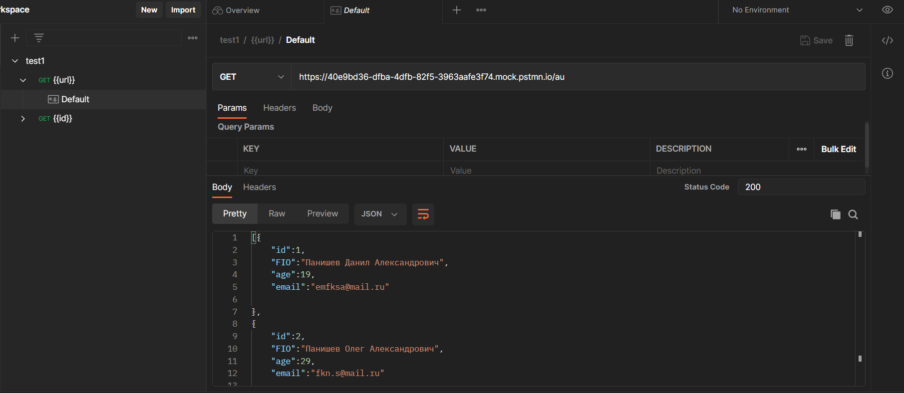
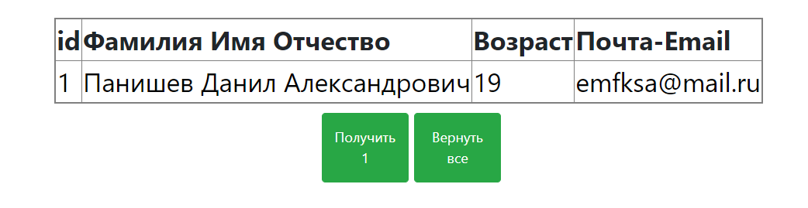
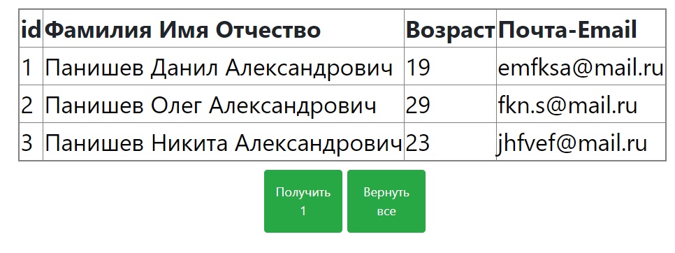
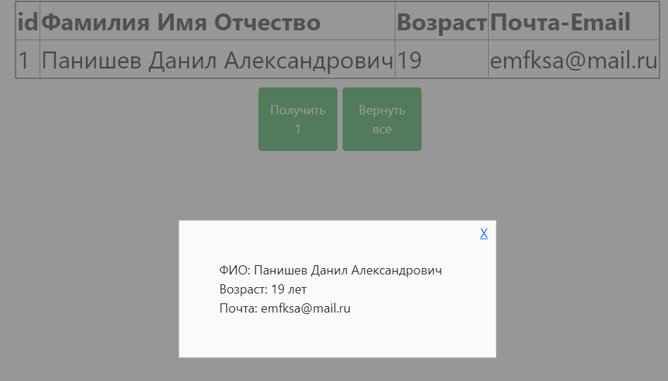

<p align = center>МИНИСТЕРСТВО НАУКИ И ВЫСШЕГО ОБРАЗОВАНИЯ

<p align = center>РОССИЙСКОЙ ФЕДЕРАЦИИ

<p align = center>ФЕДЕРАЛЬНОЕ ГОСУДАРСТВЕННОЕ БЮДЖЕТНОЕ ОБРАЗОВАТЕЛЬНОЕ УЧРЕЖДЕНИЕ ВЫСШЕГО ОБРАЗОВАНИЯ

<p align = center>«ВЯТСКИЙ ГОСУДАРСТВЕННЫЙ УНИВЕРСИТЕТ»

<p align = center>Институт математики и информационных систем

<p align = center>Факультет автоматики и вычислительной техники

<p align = center>Кафедра систем автоматизации управления
<br>
<br>
<br>
<br>

<p align = right>Дата сдачи на проверку:

<p align = right>«___» __________ 2022 г.

<p align = right>Проверено:

<p align = right>«___» __________ 2022 г.
<br>
<br>
<br>
<br>
<br>


<p align = center>Отчет по лабораторной работе № 5

<p align = center>по дисциплине

<p align = center>«Web-программирование»

<br>
<br>
<br>
<br>


<p align = center>Разработал студент гр. ИТб-2301-01-00 ________________ /Коровинский Н.С./

<p align = center>Проверил ст. преподаватель _________________ /Земцов М.А./

<p align = center>Работа защищена с оценкой «___________» «___» __________ 2022 г.

<br>
<br>
<br>
<br>

<p align = center>Киров 2022

<hr>
Цель:  получить данные с Mock Server. Отобразить их в виде таблицы.

Задачи:

1. Организовать процесс работы над лабораторной работой
1. Отправить запрос на mock-сервер и получить ответ в виде таблицы
1. По нажатию на строку таблицы выводить информацию в модальное окно

Ход выполнения:
<p>Заполнение json файла для ответа сервера

 
<p>Данные 1 пользователя 


---

<p>Данные всех пользователей 


---
<p>Модальное окно при нажатии на таблицу


<p>Код компонента</p>

---

```
<template>
  <a href="#zatemnenie" class="modalwin">dsa</a>
  <div id="zatemnenie">
    <window>
      <a href="#close_window" class="close_window">X</a>
      <div v-show="step==1">
        ФИО: {{ list1.FIO }} <br>
        Возраст: {{ list1.age }} лет<br>
        Почта: {{ list1.email }}<br>
      </div>
      <div v-show="step==2" v-for="(i) in list">
        ФИО: {{ i.FIO }} <br>
        Возраст: {{ i.age }} лет<br>
        Почта: {{ i.email }}<br>
      </div>
    </window>
  </div>


  <table>
    <tr v-show="step==1|| step==2">
      <th> id</th>
      <th> Фамилия Имя Отчество</th>
      <th> Возраст</th>
      <th> Почта-Email</th>
    </tr>
    <tr v-show="step==1">
      <td><a href="#zatemnenie" class="modalwin">{{ list1.id }}</a></td>
      <td><a href="#zatemnenie" class="modalwin">{{ list1.FIO }}</a></td>
      <td><a href="#zatemnenie" class="modalwin">{{ list1.age }}</a></td>
      <td><a href="#zatemnenie" class="modalwin">{{ list1.email }}</a></td>
    </tr><!--ряд с ячейками заголовков-->
    <tr v-show="step==2" v-for="(item) in list">
      <td><a href="#zatemnenie" class="modalwin">{{ item.id }}</a></td>
      <td><a href="#zatemnenie" class="modalwin">{{ item.FIO }}</a></td>
      <td><a href="#zatemnenie" class="modalwin">{{ item.age }}</a></td>
      <td><a href="#zatemnenie" class="modalwin">{{ item.email }}</a></td>
    </tr>
  </table>
  <div class="row">
    <button v-on:click="send()" type="button" class="btn btn-success">Получить 1</button>
    <button v-on:click="send2()" type="button" class="btn btn-success">Вернуть все</button>
  </div>
</template>

<script>

import axios from 'axios';

export default {
  data() {
    return {
      list: [{"id": 0, "FIO": "", "age": 0, "email": ""}, {
        "id": 0,
        "FIO": "",
        "age": 0,
        "email": ""
      }, {"id": 0, "FIO": "", "age": 0, "email": ""}],
      step: 0,
      let: 1,
      list1: [{"id": 0, "FIO": "", "age": 0, "email": ""}]
    }
  },

  components: {},
  methods: {

    send() {
      const url = "https://40e9bd36-dfba-4dfb-82f5-3963aafe3f74.mock.pstmn.io";

      axios
        .get(url + '/', {
          params: {},
        })
        .then((response) => {
          console.log(response.data);
          this.list1 = response.data;
          this.step = 1;
        })
        .catch((error) => {
          console.error(error);
        });
    },
    send2() {
      const url = "https://40e9bd36-dfba-4dfb-82f5-3963aafe3f74.mock.pstmn.io";

      axios
        .get(url + '/au', {
          params: {},
        })
        .then((response) => {
          console.log(response.data.id);
          this.list = response.data;
          this.step = 2;

        })
        .catch((error) => {
          console.error(error);
        });
    },
  },
};
</script>
<style>
table {
  border: 2px solid grey;
  margin: 0 auto;
}

th {
  border: 1px solid grey;
  font-size: 30px;
}

.modalwin {
  text-decoration: none;
  color: black;
}

td {
  border: 1px solid grey;
  font-size: 30px;
}

.btn {
  width: 100px;
  margin-left: 6px;
  height: 80px;
}

.row {
  display: flex;
  justify-content: center;
  margin-top: 10px;
}

#zatemnenie:target {
  display: block;
}

#zatemnenie {
  background: rgba(102, 102, 102, 0.68);
  width: 100%;
  height: 100%;
  position: fixed;
  top: 0;
  left: 0;
  display: none;
  z-index: 9999999999;
}

window {
  position: absolute;
  top: 50%;
  left: 50%;
  width: 400px;
  border: 1px solid #cecece;
  padding: 50px;
  transform: translate(-50%, -50%);
  background-color: #fafafa;
}

.close_window {
  position: absolute;
  right: 10px;
  top: 4px;
  border: none;
}

</style>

```


