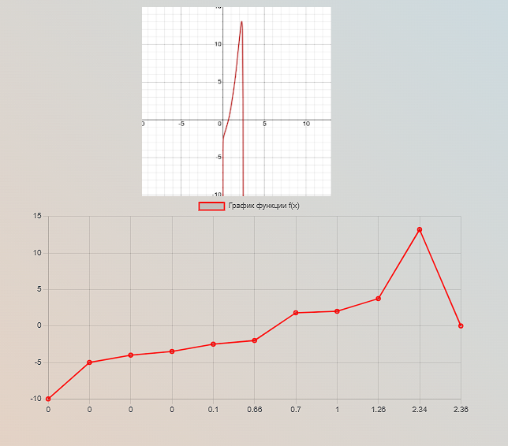

<p align=center>МИНИСТЕРСТВО НАУКИ И ВЫСШЕГО ОБРАЗОВАНИЯ
<p align=center>РОССИЙСКОЙ ФЕДЕРАЦИИ
<p align=center>ФЕДЕРАЛЬНОЕ ГОСУДАРСТВЕННОЕ БЮДЖЕТНОЕ ОБРАЗОВАТЕЛЬНОЕ
<p align=center>УЧРЕЖДЕНИЕ ВЫСШЕГО ОБРАЗОВАНИЯ
<p align=center>«ВЯТСКИЙ ГОСУДАРСТВЕННЫЙ УНИВЕРСИТЕТ»
<p align=center>Институт математики и информационных систем
<p align=center>Факультет автоматики и вычислительной техники
<p align=center>Кафедра систем автоматизации управления
<p><br>


<p align=center>Chart
<p><br><br>
<p align=right>Разработал студент гр. ИТб-2303-01-00 ________________ /Коровинкий Н.С./
<p align=right>Проверил ст. преподаватель _________________ /Земцов М.А./
<p align=right>Работа защищена с оценкой	«___________» «___» __________ 2022 г.
<p><br><br><br>
<p align=center>Киров 2022  

  ---
  
<p> Цель лабораторной работы: Построить график. 
<p align=center>

  ---
  
 html
  
  ```
  <a href="/main-menu">
  <button class="btn btn-primary" href="/">Главное меню</button>
</a>
<div class="dddd">
  
</div>
<div id="divChart">
  <canvas id="myChart"></canvas>
</div>

  ```
  
  css
  
  ```
  #divChart{
  display: block;
  width: 700px;
  height: 700px;
  margin-left: 220px;
}
.dddd img{
  margin-left: 400px;
  width: 300px;
  height:300px;
}

  ```
  ts
  
```
  import { Component, OnInit } from '@angular/core';
import { Chart, registerables } from 'chart.js';
@Component({
  selector: 'app-home',
  templateUrl: './home.component.html',
  styleUrls: ['./home.component.css']
})
export class HomeComponent implements OnInit {


  constructor() {
    Chart.register(...registerables);
  }


  ngOnInit(){
    const myChart = new Chart("myChart", {

      type: 'line',
      data: {
        labels: ['0','0','0','0', '0.1', '0.66','0.7', '1','1.26', '2.34', '2.36'],
        datasets: [{
          label: 'График функции f(x)',
          data: [-10,-5,-4,-3.5, -2.5, -2,1.8, 2,3.74, 13.2, 0],
          borderWidth: 2,
          borderColor:"red"
        }]
      },
      options: {
        scales: {
          y: {
            beginAtZero: true
          }
        }
      }
    });
  }
}

  ```

  
